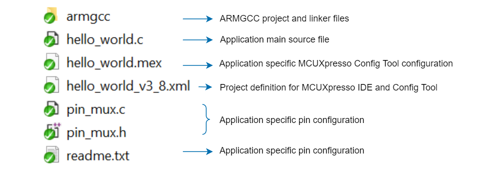

This section helps you build basic understanding of the project content and guide you how to build and run the provided example application.

# Description
In this project we focus on the delivery of device support, board support and peripheral drivers. To help user get quick understanding of peripheral drivers we also provided software examples to demonstrate how to use these peripheral drivers.

## Folder structure overview
| Folder | Description |
| :--------- | :-------- |
| boards | Board support package. For each board, there are board configuration files and board software examples |
| CMSIS | ARM CMSIS core files. |
| cmsis_drivers | ARM CMSIS driver NXP peripheral implementations. |
| components | Software components. |
| devices | Device support package. For each device, header file, feature file, startup file and linker files are provided, also device specific drivers are included. |
| docs | Documentation. |
| drivers | Peripheral drivers. |
| manifests | Manifest files, used in MCUXpresso IDE and tools. |
| middleware | Middleware components used in software examples. |
| tools | Software tools. |
| utilities | Software utilities. |

## Board package support
Board package support located in boards/ folder, within each {board_name} folder, there are sub-folders to classify the type of examples it contain.
These include (but are not limited to):
- demo_apps: Basic demo set to start using SDK, including hello_world and led_blinky.
- driver_examples: Simple applications that show how to use the peripheral drivers for a single use case. These applications typically only use a single peripheral but there are cases where multiple peripherals are used (for example, SPI transfer using DMA).

Board configuration files are shown in boards/{board_name} folder, includes board.c/h and clock_config.c/h. **The board configuration files are shared between most of board software examples**. If example has its specific board configuration files, the files will be located in application folder.

## Software example structure
Each {board_name} folder in the boards directory contains a comprehensive set of examples that are relevant to that specific piece of hardware. Although we use the hello_world example (part of the demo_apps folder), the same general rules apply to any type of example in the {board_name} folder.
In the hello_world application folder you see the following contents:

# Build and run example application
Using MCUXpresso IDE: Check steps in [Run a project using MCUXpresso IDE](run_a_project_using_mcux.md)

Using ARMGCC: Check steps in [Run a project using ARMGCC](run_a_project_using_armgcc.md)
